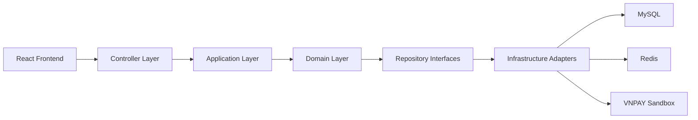
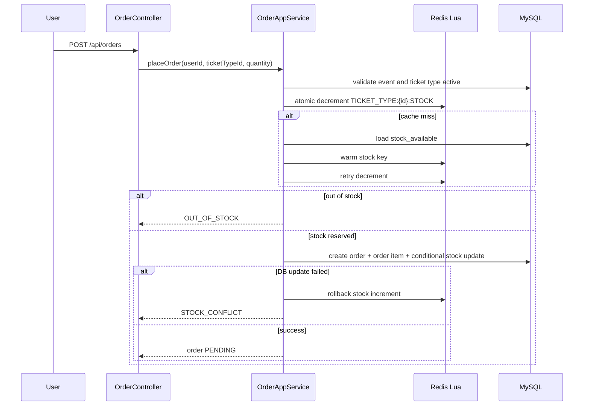

# Event Ticket Booking DDD Redesign Spec

Date: 2026-05-22  
Goal: Redesign the current project into a cleaner personal CV project for a fresher Java/Spring position, while keeping the existing multi-module DDD structure and the Redis Lua high-concurrency stock flow.

## 1. Product Scope

The new product is a simple event ticket booking system. It should be easy to run locally, easy to explain in an interview, and strong enough to demonstrate backend fundamentals, frontend integration, security, transaction handling, and Redis usage.

The project will keep:

- Multi-module DDD-style backend.
- React frontend.
- MySQL persistence.
- Redis for refresh tokens, cache, and stock.
- Redis Lua atomic stock deduction.
- Email/password auth with access token and refresh token.
- Google OAuth2 login.
- USER and ADMIN roles.
- Mock payment and VNPAY sandbox payment.

The project will remove:

- Kafka.
- RabbitMQ.
- Prometheus.
- Grafana.
- ELK.
- Resilience4j demo endpoints.
- Employee sign-in demo.
- API key secure demo.
- Monthly sharded order tables.
- JMeter/k6 benchmark artifacts unless kept only as optional documentation.

## 2. Architecture

The backend will keep the existing module shape:

```text
xxxx-start
xxxx-controller
xxxx-application
xxxx-domain
xxxx-infrastructure
xxxx.fe.com
```

Module responsibilities:

```text
xxxx-start
- Application bootstrap
- application.yml
- profile and environment config
- Spring Boot main class

xxxx-controller
- REST controllers
- request DTOs
- response DTOs
- request validation
- exception handler
- web security entrypoints where needed

xxxx-application
- use case orchestration
- transaction boundaries
- auth service
- token service
- order service
- payment service
- cache orchestration

xxxx-domain
- domain entities
- value objects/enums
- domain services
- repository interfaces
- business rules

xxxx-infrastructure
- JPA repository adapters
- Redis adapter
- Redis Lua stock adapter
- JWT provider
- OAuth2 success handler / user adapter
- VNPAY gateway adapter
```

High-level flow:



## 3. Domain Model

The new model should use clear names and avoid the current ambiguity between `ticketId` and `ticket_item.id`.

Core concepts:

| Domain | Purpose |
| --- | --- |
| `User` | Account that can login and book tickets. |
| `Role` | `USER` or `ADMIN`. |
| `Event` | Public event that users can view and book. |
| `TicketType` | Ticket tier for an event, including price and stock. |
| `Order` | User booking transaction. |
| `OrderItem` | One ticket type inside an order. |
| `Payment` | Payment attempt for an order. |
| `RefreshToken` | Login session/refresh token metadata. |

Suggested tables:

```text
users
roles
user_roles
events
ticket_types
orders
order_items
payments
refresh_tokens
```

Important naming decision:

```text
eventId       = id of the event
ticketTypeId  = id of the ticket tier being purchased
orderId       = id of the user order
paymentId     = id of the payment record
```

All order APIs must accept `ticketTypeId`, not a vague `ticketId`.

## 4. User Roles

The project will support two roles.

`USER` can:

- Register with email/password.
- Login with email/password.
- Login with Google.
- Refresh access token.
- Logout.
- View active events.
- View event detail.
- Place order.
- Pay with mock payment.
- Pay with VNPAY sandbox.
- View own orders.
- Cancel own pending order.

`ADMIN` can:

- Login.
- Create event.
- Update event.
- Activate/inactivate event.
- Delete event if allowed by business rule.
- Create/update/delete ticket type.
- View all orders.
- View order detail.
- Manage event/ticket stock.

## 5. Authentication And Authorization

The backend will use Spring Security.

Token model:

```text
Access token:
- JWT
- short-lived, suggested 15 minutes
- contains user id, email, roles

Refresh token:
- random opaque token, not JWT
- long-lived, suggested 7-30 days
- stored in Redis and optionally persisted in MySQL
- rotated on refresh
```

Email/password auth endpoints:

```text
POST /api/auth/register
POST /api/auth/login
POST /api/auth/refresh
POST /api/auth/logout
GET  /api/auth/me
```

Google OAuth2 endpoints:

```text
GET /oauth2/authorization/google
GET /login/oauth2/code/google
```

OAuth2 behavior:

1. User clicks "Login with Google" on frontend.
2. Backend redirects to Google authorization.
3. Google redirects back to backend callback.
4. Backend finds or creates user by email.
5. Backend assigns default role `USER`.
6. Backend creates access token and refresh token.
7. Backend redirects frontend with a short one-time auth code or sets secure cookies.

Preferred CV-friendly implementation:

- Store refresh token in HttpOnly cookie.
- Return access token in JSON after normal login.
- For Google login, redirect frontend to a callback page with a one-time code, then frontend exchanges it for tokens.

Authorization rules:

```text
Public:
- GET /api/events
- GET /api/events/{id}
- auth endpoints
- OAuth2 endpoints

USER:
- /api/orders/**
- /api/payments/**

ADMIN:
- /api/admin/**
```

## 6. Event And Ticket Management

Public APIs:

```text
GET /api/events
GET /api/events/{eventId}
```

Admin APIs:

```text
POST   /api/admin/events
PUT    /api/admin/events/{eventId}
DELETE /api/admin/events/{eventId}
PUT    /api/admin/events/{eventId}/active
PUT    /api/admin/events/{eventId}/inactive

POST   /api/admin/events/{eventId}/ticket-types
PUT    /api/admin/ticket-types/{ticketTypeId}
DELETE /api/admin/ticket-types/{ticketTypeId}
```

Business rules:

- Only active events are visible to public users.
- Ticket type belongs to one event.
- Ticket type must have non-negative stock.
- Price must be positive.
- Event cannot be deleted if it has paid orders. It can be marked inactive instead.

Redis cache:

```text
EVENT:LIST:ACTIVE
EVENT:{eventId}
TICKET_TYPE:{ticketTypeId}
```

Cache invalidation:

- Event create/update/delete invalidates active event list and event detail.
- Ticket type update invalidates event detail and ticket type cache.

## 7. Order Flow With Redis Lua

This flow is a key technical highlight and should be kept clean.

Order API:

```text
POST /api/orders
```

Request:

```json
{
  "ticketTypeId": 1,
  "quantity": 2
}
```

Order placement flow:



Redis keys:

```text
TICKET_TYPE:{ticketTypeId}:STOCK
```

Lua decrement behavior:

```text
- return -1 when key does not exist
- return 0 when stock is not enough
- return 1 when decrement succeeds
```

Database safety update:

```sql
UPDATE ticket_types
SET stock_available = stock_available - :quantity
WHERE id = :ticketTypeId
  AND stock_available >= :quantity
```

Rollback rule:

- If Redis decrement succeeds but database transaction fails, increment Redis stock back.
- If Redis rollback fails, log an error and store a reconciliation record or admin warning. For CV scope, an explicit follow-up note is acceptable, but a `stock_adjustment_log` table is better.

## 8. Cancel Order Flow

API:

```text
PUT /api/orders/{orderId}/cancel
```

Rules:

- USER can cancel only own order.
- ADMIN can cancel any order if business rule allows.
- Only `PENDING` order can be cancelled.
- Cancelling restores MySQL stock and Redis stock.

Flow:

```text
1. Load order.
2. Verify ownership or ADMIN role.
3. Verify status is PENDING.
4. Update order to CANCELLED.
5. Increment ticket_types.stock_available.
6. Increment Redis stock key.
```

## 9. Payment Flow

Order statuses:

```text
PENDING
PAID
CANCELLED
PAYMENT_FAILED
EXPIRED
```

Payment statuses:

```text
INIT
PENDING
SUCCESS
FAILED
```

Mock payment API:

```text
POST /api/payments/{orderId}/mock-success
```

Mock payment behavior:

```text
1. Verify authenticated user owns order or is ADMIN.
2. Verify order is PENDING.
3. Create payment record with method MOCK.
4. Mark payment SUCCESS.
5. Mark order PAID.
```

VNPAY APIs:

```text
POST /api/payments/{orderId}/vnpay
GET  /api/payments/vnpay/callback
```

VNPAY behavior:

```text
1. User requests VNPAY payment URL.
2. Backend creates payment PENDING.
3. Backend builds signed VNPAY sandbox URL.
4. Frontend redirects user.
5. VNPAY callback returns to backend.
6. Backend verifies signature.
7. Payment becomes SUCCESS or FAILED.
8. Order becomes PAID or PAYMENT_FAILED.
```

VNPAY config must not be hardcoded. Use environment/application config:

```text
vnpay.tmn-code
vnpay.secret-key
vnpay.pay-url
vnpay.return-url
```

## 10. API Groups

Public:

```text
GET /api/events
GET /api/events/{eventId}
```

Auth:

```text
POST /api/auth/register
POST /api/auth/login
POST /api/auth/refresh
POST /api/auth/logout
GET  /api/auth/me
GET  /oauth2/authorization/google
GET  /login/oauth2/code/google
```

User:

```text
POST /api/orders
GET  /api/orders/my
GET  /api/orders/{orderId}
PUT  /api/orders/{orderId}/cancel
POST /api/payments/{orderId}/mock-success
POST /api/payments/{orderId}/vnpay
```

Admin:

```text
POST   /api/admin/events
PUT    /api/admin/events/{eventId}
DELETE /api/admin/events/{eventId}
PUT    /api/admin/events/{eventId}/active
PUT    /api/admin/events/{eventId}/inactive

POST   /api/admin/events/{eventId}/ticket-types
PUT    /api/admin/ticket-types/{ticketTypeId}
DELETE /api/admin/ticket-types/{ticketTypeId}

GET    /api/admin/orders
GET    /api/admin/orders/{orderId}
```

## 11. Frontend Scope

Keep React + Vite. Clean the frontend around the new API shape.

Pages:

```text
Public:
- Home
- Event list
- Event detail

Auth:
- Login
- Register
- OAuth2 callback

User:
- My orders
- Checkout/payment
- Payment result

Admin:
- Event management
- Ticket type management
- Order management
```

Frontend auth behavior:

- Store access token in memory or local storage for CV simplicity.
- Prefer refresh token in HttpOnly cookie.
- Axios interceptor attaches access token.
- On 401, call refresh endpoint once and retry original request.
- Protected routes redirect unauthenticated users to login.
- Admin routes require `ADMIN` role.

## 12. Local Development

Keep Docker Compose minimal:

```text
MySQL
Redis
```

Remove from required local stack:

```text
Kafka
Prometheus
Grafana
ELK
```

Suggested local services:

```text
Backend: http://localhost:1122
Frontend: http://localhost:5173
MySQL: localhost:3316
Redis: localhost:6319
```

Required docs:

```text
README.md
docs/ONBOARDING_REPORT.md
docs/API.md
.env.example
```

## 13. Testing Strategy

Backend tests should be part of the CV story.

Priority tests:

```text
Auth:
- register success
- login success/fail
- refresh token rotation
- logout invalidates refresh token

Order:
- place order success
- out of stock
- Redis cache miss warmup
- DB stock conflict triggers Redis rollback
- cancel pending order restores stock

Payment:
- mock payment marks order PAID
- VNPAY callback success/fail paths

Security:
- USER cannot access admin APIs
- unauthenticated user cannot create order
```

Suggested tools:

```text
spring-boot-starter-test
spring-security-test
testcontainers-mysql
embedded redis or testcontainers redis
mockmvc
```

Frontend tests are optional for initial CV scope. If added, focus on smoke tests for login, event list, and order placement.

## 14. Implementation Phases

Phase 1: Project cleanup and dependency alignment

- Remove Kafka dependencies/code.
- Remove monitoring-only dependencies/config.
- Remove demo controllers.
- Keep Redis and JPA.
- Align Spring Boot versions.
- Add Spring Security dependencies.

Phase 2: Data model and migrations

- Create clean schema for users, roles, events, ticket_types, orders, order_items, payments, refresh_tokens.
- Replace old `ticket`/`ticket_item` naming with `events`/`ticket_types`.
- Seed one admin user and sample events.

Phase 3: Auth

- Implement register/login/logout/refresh.
- Implement JWT access token.
- Store refresh tokens in Redis.
- Implement Google OAuth2 login.
- Add role-based authorization.

Phase 4: Event and admin management

- Public event list/detail.
- Admin event CRUD.
- Admin ticket type CRUD.
- Redis cache for event detail/list.

Phase 5: Order with Redis Lua

- Implement stock warmup.
- Implement Lua decrement/increment.
- Implement place order transaction.
- Implement cancellation.
- Add tests for stock consistency.

Phase 6: Payment

- Implement mock payment.
- Refactor VNPAY config.
- Implement VNPAY create payment URL and callback.

Phase 7: Frontend rebuild

- Update route structure.
- Implement auth pages.
- Implement public event pages.
- Implement user order/checkout.
- Implement admin pages.

Phase 8: Documentation and polish

- API docs.
- README run guide.
- Screenshots/GIFs.
- CV project summary.

## 15. Risks And Decisions

Decisions:

- Keep DDD multi-module.
- Keep Redis Lua order flow.
- Remove Kafka and monitoring.
- Use `ticketTypeId` in order APIs.
- Keep both mock payment and VNPAY.
- Use only `USER` and `ADMIN` roles.

Risks:

- Scope can become large. Keep UI simple and prioritize backend completeness.
- OAuth2 and refresh token flows can consume time. Implement email/password JWT first, then Google.
- VNPAY callback setup can be awkward locally. Mock payment must remain available for demo.
- Redis + DB stock consistency needs tests to be credible.

Success criteria:

- A recruiter can run the project with MySQL + Redis only.
- User can register/login, browse events, order tickets, pay, and see order history.
- Admin can manage events/ticket types/orders.
- Redis Lua stock flow is documented and tested.
- README clearly explains DDD modules and key technical choices.
